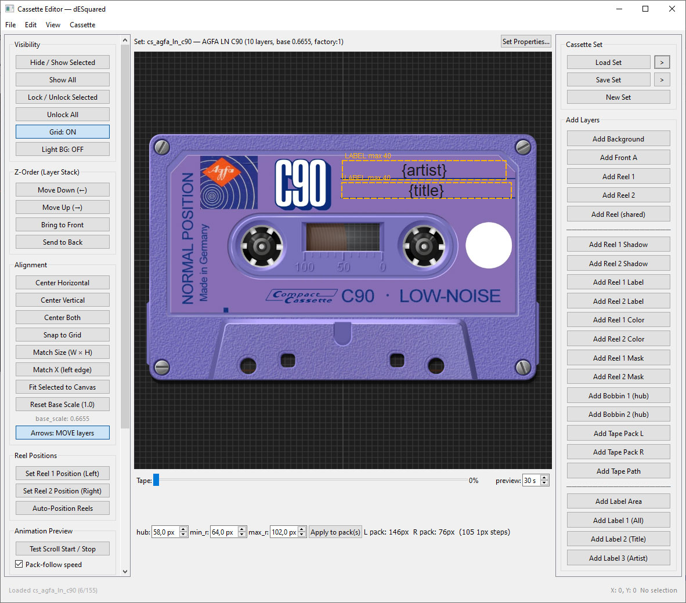

# dESquared

Аудиоплеер для портативных плееров с собственным «кассетным» интерфейсом. Писался под
**Anbernic RG Rotate (720×720)** и **HiBy R6III**, но работает на любом Android 12+.

## Скачать

- Сборки — в разделе **[Releases](../../releases/latest)**: файл `dESquared-x.y.z.apk`
  (рядом лежит `.sha256`).
- ⚠️ Сборки **0.5–0.8.8** подписаны другим ключом: обновление «поверх» не установится, старую
  версию нужно удалить и поставить новую заново. Начиная с 1.0.4 подпись одна и та же.
- Приложение умеет проверять обновления само: **Настройки → Проверить обновления**
  (автопроверка при запуске, качает APK и отдаёт системному установщику).

## Основные возможности

### Кассеты
- **155 наборов кассет**, отрендеренных с фотографий реальных лент (BASF, TDK, Sony, Denon,
  Agfa, Victor, Aiwa…): корпус, ролики, лента, заводские наклейки.
- Режимы экрана: **кассета** или **обложка**; в кассетном режиме обложка показывается фоном.
- **Автосмена кассет**: случайно / по порядку / по году (от старых к новым и наоборот).
- Подпись на наклейке берётся из тегов (`{title}`, `{artist}`, свои шаблоны), шрифт и размер
  настраиваются; для корпусов с полосой вдоль корпуса — **вертикальные наклейки**.
- Пикер кассет с музейной справкой (год, заметка, страна).

### Файловый менеджер
- Внутренняя память, SD-карта и **сетевые хранилища (SMB2/3)**: вход по IP, логину и паролю,
  поиск доступных шар.
- Плотные строки, колонка формата, обложки папок и файлов, поиск, масштаб списка.
- По долгому нажатию: переименовать, создать папку внутри, копировать, переместить, удалить
  (с подсчётом файлов и объёма). Копирование и перенос — с полоской прогресса, работают и между
  шарой и памятью.
- Кнопка **`+`** в выезжающем ряду (потянуть список вниз) создаёт папку в текущем каталоге.

### Звук
- **Параметрический эквалайзер (PEQ)** и обычный EQ, полосы настраиваются по частоте, добротности
  и типу фильтра.
- **Каталог AutoEq** — больше 8800 профилей наушников, поиск офлайн, профиль скачивается по сети
  и подставляет полосы целиком.
- Свои пресеты EQ/PEQ (попадают в бэкап), предусилитель, индикатор реального выхода
  (**SRC 44.1→48**) с разбором по долгому нажатию.

### Плейлист и библиотека
- Плейлист, избранное, история прослушивания, статистика и достижения.
- Мультивыбор: играть следующим, в конец очереди, удалить.
- Заголовки альбомов с годом, у каждого трека третья строка «год · альбом».
- Порядок и режимы: шаффл (в том числе предсказуемый), повтор, **кроссфейд** и **gapless**.

### Экран и управление
- Зоны-жесты по четвертям экрана с иконками (статистика, настройки, кассета, эквалайзер),
  настройка размера, чувствительности, прозрачности и вибрации.
- Перепривязка аппаратных кнопок, тосты о нажатиях, таймер сна
  (15–120 мин, пауза / пауза и закрыть / выход с затуханием).
- **Виджеты**: информационный и кассетный (с анимацией), содержимое экрана блокировки.
- Для квадратных экранов — встроенная QWERTY для поиска, переименования и создания папок.

### Прочее
- **Шесть языков**: русский, английский, испанский, китайский, корейский, японский.
- **Бэкап настроек** одним zip-файлом (`dESquared/backup`) и восстановление из него.
  Пароли от сетевых хранилищ в бэкап не попадают.
- Тёмный интерфейс, акцентный цвет подбирается по обложке.
- Размер APK ~45 МБ: картинки кассет упакованы в WebP без заметной потери качества.

## Редактор кассет

В корне репозитория лежит **`cassette_editor.7z`** — отдельный инструмент, которым собираются и
правятся наборы кассет (в плеер он не входит и ставится отдельно).

**Что внутри архива**
- сам редактор (`cassette_editor/`), запускалки `run_editor.py` / `run_editor.bat`,
  `requirements.txt` и `README.md` с описанием горячих клавиш;
- папка `cassettes/` — все 155 наборов плеера как примеры: JSON-описание и картинки WebP.
  Можно открыть любой, посмотреть, как он устроен, и сделать свой по образцу.

**Как запустить (Windows)**
1. Распаковать архив в любую папку.
2. Поставить Python 3.11+ и зависимости: `pip install -r requirements.txt`
   (нужны PySide6 и Pillow).
3. Запустить `run_editor.bat` — или `python run_editor.py`.

**Что умеет**
- открывать и сохранять набор: `Save`, `Save Set and Next`, `Save As`; листать наборы по порядку
  кнопкой `>` рядом с `Load Set` (или `Ctrl+→`) — папка с наборами определяется автоматически;
- править слои: положение, масштаб, поворот, прозрачность, режим смешивания, порядок по z;
- заводскую наклейку: текст, шрифт (включая свой TTF), размер, рамку, выравнивание, бегущую
  строку и **вертикальные наклейки** для корпусов с полосой вдоль корпуса;
- выравнивать два выделенных слоя одной кнопкой — по размеру (ширина и высота) и по левому краю;
- заполнять музейную справку набора: год, заметка, страна и флаг (их показывает пикер кассет
  в плеере);
- экспортировать набор для Android: раскладка и картинки складываются в папку `assets`.

---

# dESquared (English)

An audio player for portable players with its own **cassette-style interface**. Built for the
**Anbernic RG Rotate (720×720)** and **HiBy R6III**, runs on any Android 12+.

- **Cassettes**: 155 skins rendered from photos of real tapes, cassette or cover view, cover as
  the background, automatic cassette change (random / in order / by year), label text from tags,
  vertical labels, picker with museum notes.
- **File manager**: internal storage, SD card and **SMB2/3 shares**; dense rows, format column,
  folder covers, search; long-press to rename, create a folder, copy, move, delete — copy and move
  show a progress bar and work between a share and the device; a **`+`** button in the pull-down row
  creates a folder in the current directory.
- **Sound**: parametric EQ (PEQ) and EQ, the **AutoEq catalogue** with 8800+ headphone profiles,
  your own presets, preamp, real output indicator (SRC 44.1→48).
- **Playlist**: playlist, favourites, history, statistics and achievements, multi-select, album
  headers with the year, "year · album" line, shuffle / repeat, **crossfade** and **gapless**.
- **Controls**: corner gesture zones with icons, hardware button remapping, sleep timer, info and
  animated cassette widgets, lock-screen content, built-in QWERTY on square screens.
- **Also**: six languages (ru/en/es/zh/ko/ja), settings backup to a zip, dark UI with an accent
  colour taken from the cover art, APK ~45 MB.

## Cassette editor

**`cassette_editor.7z`** in the repository root is a separate tool (not part of the player) used to
build and edit cassette sets. It contains the editor itself (`cassette_editor/`, `run_editor.py`,
`run_editor.bat`, `requirements.txt`), a README with shortcuts, and the whole `cassettes/` folder —
all 155 sets as examples (JSON + WebP art) to copy as a starting point.

Run it with Python 3.11+: `pip install -r requirements.txt` (PySide6, Pillow), then
`run_editor.bat` (or `python run_editor.py`). It can open/save sets and step through them with the
`>` button (or `Ctrl+→`), edit layers and the factory label (font, size, marquee, **vertical
labels**), align two selected layers by size and left edge, fill in the museum info (year, note,
country, flag) and export a set for Android.

## Install

Download `dESquared-x.y.z.apk` from **[Releases](../../releases/latest)** and install it. Builds
0.5–0.8.8 are signed with a different key, so uninstall the old version first; from 1.0.4 on the
key is the same and the app offers updates itself (**Settings → Check for updates**).
